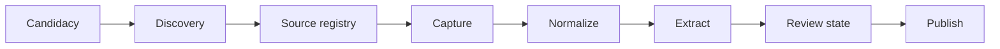

# Municipal Election Explorer Architecture

## Status and scope

This document records the architecture for the 2026 Chatham-Kent fixture-backed
vertical slice through Milestone 2. It favors a small, inspectable system that
can grow through clear module boundaries.

It is an implementation guide, not approval to ingest restricted sources,
change production data, or publish a public site.

## Architectural principles

1. Model the product as an evidence pipeline, not a crawler.
2. Keep each stage independently rerunnable and idempotent.
3. Preserve immutable inputs before transforming them.
4. Treat provenance as domain data, not logging.
5. Separate a person from their election-specific candidacy.
6. Keep source-specific behavior at the pipeline boundary.
7. Make normalized content source-agnostic.
8. Publish only statements whose status is `approved`, through an explicit
   publication record.
9. Prefer a modular monolith until operational evidence justifies a split.
10. Keep AI prompts and schemas versioned and auditable.

The rules in `VISION.md`, especially the Statement Attribution Policy, govern
all extraction, review, and presentation decisions.

## System shape

The first implementation is one Next.js and TypeScript application backed by
PostgreSQL. Ingestion and maintenance run as typed scripts using the same domain
modules as the application.

```text
municipal-election-explorer/
  app/
  components/
  lib/
    ai/
    db/
    discovery/
    ingest/
    review/
  scripts/
  prompts/
  drizzle/
  docs/
  VISION.md
  ARCHITECTURE.md
```

There is no separate API service or worker deployment in Phase 1. Next.js
server code serves public reads, while scripts invoke application services for
imports and ingestion. Modules may move into packages or workers later without
changing the domain contracts.

### Initial technology choices

- Next.js and TypeScript
- Tailwind CSS
- Supabase PostgreSQL
- Drizzle ORM with explicit, reviewed migrations
- Private object storage for raw captures
- Structured AI output with version-controlled prompts
- PostgreSQL full-text search for initial keyword search
- Playwright for the end-to-end evidence path

The initial database should enable the `vector` extension when the chosen
Supabase environment supports it. Enabling pgvector does not create useful
embeddings by itself. Embedding generation and a model-specific vector table
remain deferred until dimensions, model/version retention, cost, re-embedding,
and retrieval evaluation are defined. Because normalized content is retained,
an embedding corpus can be backfilled without recapturing sources.

## Evidence pipeline



Each stage has an explicit input, durable output, status, timestamps, and error
record. A failed stage does not mutate or erase the previous successful stage.
Retries reuse deterministic idempotency keys.

### 1. Discovery

Discovery finds possible public sources associated with a candidacy. It is
separate from ingestion because finding a URL does not establish identity,
authenticity, permission, or suitability.

The durable output is a `DiscoveredSource` with:

- the associated candidacy;
- canonical and originally observed URLs;
- proposed source type;
- discovery method and run;
- evidence supporting the candidate association;
- status such as `proposed`, `accepted`, or `rejected`; and
- timestamps and reviewer notes when applicable.

Phase 1 may use manual discovery. Automated web or platform discovery can be
added later without changing capture or extraction.

Only an accepted discovery result becomes a registered `Source`.

### 2. Source registry

The registry contains sources the system is permitted to capture. It records
ownership or attribution, source type, canonical URL, candidacy association,
active status, collection policy, and adapter configuration.

A source is a stable identity. It is not the content itself.

### 3. Capture

A source adapter retrieves or accepts source material and creates an immutable
`SourceSnapshot`.

A snapshot records:

- source and adapter version;
- original and final URL;
- capture timestamp;
- publication timestamp when supplied by the source;
- response metadata;
- raw-content object location;
- media type and byte size;
- cryptographic content hash;
- source-native identifier when available; and
- success, unchanged, blocked, or failure status.

Raw bytes are written before downstream transformation. Identical hashes may be
deduplicated, but an attempted capture still has its own run record.

### 4. Normalize

Normalization converts a snapshot into the common `ContentItem` contract.
Source-specific parsing ends at this boundary.

```typescript
type ContentItem = {
  sourceId: string;
  snapshotId: string;
  sourceType: SourceType;
  externalId?: string;
  canonicalUrl: string;
  author?: string;
  publishedAt?: string;
  capturedAt: string;
  title?: string;
  text: string;
  attachments: AttachmentRef[];
  metadata: Record<string, unknown>;
};
```

The persisted form also records normalizer version, normalized-text hash, and
location mapping back to the snapshot. Web text uses stable block or character
locations; PDFs use pages; audio and video transcripts use time ranges.

### 5. Extract

An extraction run consumes one or more normalized content items and emits draft
statements, evidence records, and controlled issue associations.

Every run records:

- prompt key, version, and content hash;
- structured-output schema version;
- model and provider identifier;
- input content hashes;
- execution timestamp and outcome; and
- raw structured result or a private reference to it.

The extractor must identify the attributed speaker, distinguish direct quotes
from campaign communications, quote supporting text, and abstain when the
Statement Attribution Policy is not satisfied.

Confidence is review metadata, not evidence and not a publication decision.

### 6. Review state

Phase 1 stores `draft` or `approved` on each statement. It does not require a
review UI, user-account system, or workflow engine.

Changing a statement to `approved` asserts that its attribution, summary,
issue association, and evidence have been checked under the current policy.
The initial vertical slice may use a narrow development-only mechanism to set
this state. A review history table and dedicated interface can be introduced
when a real editorial workflow is specified.

### 7. Publish

Publishing an approved statement creates a `Publication` record containing the
statement version, publication time, and current public state. Unpublishing
closes that record with a time and reason; it does not delete the statement or
evidence.

Public queries select active publications whose statements remain approved.
Drafts, raw captures, private review notes, and raw AI responses are not public.

Every published statement displays:

- the candidate or campaign attribution;
- a restrained factual summary;
- supporting quotation when appropriate;
- issue labels from the controlled taxonomy;
- source title and original link;
- original publication date when known; and
- capture or verification context needed to understand freshness.

Removal from public display does not delete the underlying evidence record.

## Importers and source adapters

The official candidate importer is separate from content ingestion. It writes
election-specific candidacies and official status observations; it does not
produce a `ContentItem`. Forcing candidate roster data into the content-adapter
contract would make that contract ambiguous.

Each source integration supplies two stage-specific components:

- a capture adapter that writes an immutable `SourceSnapshot`; and
- a normalizer that reads that snapshot and returns the common `ContentItem`
  contract.

This keeps capture and normalization independently rerunnable while making
everything after normalization source-agnostic.

Planned ingestion types are:

| Integration | Kind | Phase 1 status | Notes |
|---|---|---|---|
| Official candidate list | Candidate importer | Fixture implemented | Exact saved bytes, source metadata, and candidacy status history |
| Website | Content adapter | Fixture implemented | Accepted candidate-owned saved pages only |
| Manual discovery | Discovery input | Fixture implemented | Proposed result requires explicit accept/reject review |
| PDF | Content adapter | Planned | Requires page-level evidence mapping |
| YouTube | Content adapter | Planned | Requires compliant transcript acquisition and timecodes |
| News | Content adapter | Planned | Direct quotations only; excerpt and rights controls |
| Facebook | Content adapter | Gated | Requires platform, privacy, and terms review |
| Instagram | Content adapter | Gated | Requires platform, privacy, and terms review |

Planning an integration does not authorize its implementation. Each importer
or adapter must define identity checks, collection rules, rate limits, content
limits, error behavior, and its evidence or provenance strategy.

## Domain model

### Election identity

- `Municipality`: stable municipal identity and configuration key.
- `Election`: municipality, election date, term, and lifecycle status.
- `Office`: mayor, councillor, or another configured elected office.
- `Ward`: election-specific ward identity and boundaries metadata.
- `Person`: the human identity, independent of an election.
- `Candidacy`: a person's registration for one election, office, and optional
  ward, including official status history.

Statements and sources attach to `Candidacy`, not directly to `Person`. This
prevents 2026 evidence from silently appearing as evidence for a later run.

### Discovery and sources

- `DiscoveryRun`: method, configuration, start/end time, and outcome.
- `DiscoveredSource`: proposed candidacy/source association and disposition.
- `Source`: accepted source identity and collection policy.
- `CaptureRun`: each capture attempt and its outcome.
- `SourceSnapshot`: immutable captured representation.
- `ContentItem`: normalized, source-agnostic content.
- `Attachment`: media associated with a content item.

### Extraction and publication

- `PromptDefinition`: logical prompt key and current repository path.
- `ExtractionRun`: immutable AI execution provenance.
- `Statement`: restrained summary, attribution, status, and lifecycle dates.
- `Evidence`: exact quotation and location in a content item or snapshot.
- `Issue`: controlled issue name, slug, description, and active state.
- `StatementIssue`: many-to-many association between statements and issues.
- `Publication`: durable public-release lifecycle for an approved statement
  version.

A statement may have multiple evidence records and multiple issues. An
extractor may return no issue rather than inventing one.

Initial issue examples may include healthcare, housing, roads, transit, taxes,
water, and agriculture, but the launch taxonomy must be documented and
approved before it is seeded. Issue names must not encode ideological judgment.

## Prompt management

Prompts live under `prompts/` as standalone, reviewable files. Application code
loads them by logical key and records a content hash on each extraction run.

The first extraction prompt should be named for the allowed operation, for
example:

```text
prompts/
  extract-statements.md
  assign-issues.md
  extract-quotes.md
```

`extract-positions.md` is intentionally avoided because "position" can invite
inference beyond explicit statements. Automatically generated candidate
summaries are also outside the first vertical slice. Either capability would
need a policy-compatible output contract and explicit approval.

Prompt files define:

- allowed inputs and outputs;
- the Statement Attribution Policy;
- abstention behavior;
- controlled issue identifiers;
- quotation and location requirements;
- forbidden inference;
- structured schema expectations; and
- adversarial examples and edge cases.

Changing a prompt creates new extraction runs; it does not silently rewrite
the historical record.

## Data integrity and reruns

The pipeline uses stage-specific idempotency keys:

- official import stage: election, source, observation time, and exact payload
  hash; the database logical key omits the hash so changed bytes conflict;
- discovery record: election, method/version, exact fixture hash, and start time;
- discovery decision: discovered-source identity and terminal action;
- capture: source, adapter version, and capture request;
- normalization: snapshot hash and normalizer version;
- extraction: content hashes, prompt hash, schema version, and model;
- publication: statement identity and approved version.

Important constraints include:

- a candidacy belongs to exactly one election and office;
- ward is required only for ward-based offices;
- snapshots are immutable after successful capture;
- evidence cannot reference content outside the extraction input;
- approved statements require at least one valid evidence record;
- publications can reference only approved statements;
- public queries cannot return drafts or closed publications; and
- official candidate updates append status history rather than erase it.

## Safety boundaries

### Acquisition

- Fetch only registered and active sources.
- Block loopback, link-local, private-network, and unsafe redirect targets.
- Set timeouts, response-size limits, content-type allowlists, and a clear user
  agent.
- Rate-limit per host and respect source-specific collection rules.
- Sanitize captured markup; never execute source scripts.
- Treat downloaded files as untrusted.

### Privacy and publication

- Keep raw captures and AI responses private by default.
- Collect only information needed for the civic-record purpose.
- Do not ingest private groups, private accounts, leaked material, or personal
  contact data unrelated to candidacy.
- Support correction and takedown decisions without destroying audit records.
- Do not republish full third-party works when a supporting excerpt and
  original link are sufficient.

### AI

- Use structured outputs validated at the application boundary.
- Treat malformed, unsupported, or ambiguous output as a failed extraction.
- Never let model output select its own evidence source.
- Prevent prompt content from changing system policy.
- Record enough metadata to reproduce or compare extraction behavior.

## Search

Initial search uses PostgreSQL full-text search over published statement
summaries and evidence excerpts, plus filters for municipality, election,
office, ward, candidate, and controlled issue.

Issue pages are evidence groupings, not comparisons or rankings. Counts and
missing results must be presented carefully so source volume is not mistaken
for candidate importance or engagement.

Semantic retrieval is a later capability. It requires an evaluated embedding
model, versioned vectors, a re-embedding strategy, relevance tests, and UI
language that does not imply unsupported equivalence.

## Testing strategy

- Domain tests for candidacy identity and status changes.
- Contract tests shared by every source adapter.
- Fixture tests for official imports and normalization.
- Provenance tests proving evidence maps to captured text.
- Structured-output tests for abstention and attribution failures.
- Database tests for immutability and publication constraints.
- End-to-end tests for the complete published-statement path.
- Accessibility checks for public candidate and evidence views.

The first vertical slice should use saved fixtures wherever possible. Live
network acquisition is tested separately and never required for the main test
suite.

## Deployment evolution

The modular monolith may be split only when measured requirements justify it.
Likely future boundaries are scheduled discovery, capture workers, media
transcription, and AI extraction. These components must continue to call the
same versioned stage contracts and write the same provenance records.

Public deployment, production database writes, external scheduled ingestion,
and social-platform collection each remain separate approval gates.

## First vertical slice

The first implementation slice is intentionally narrow:

1. Load the configured Chatham-Kent election.
2. Import official candidacies from a saved municipal fixture.
3. Record one candidate-owned website discovery as proposed.
4. Explicitly accept it into the source registry.
5. Capture one page into an immutable snapshot.
6. Normalize it into a `ContentItem`.
7. Extract one or more evidence-backed draft statements.
8. Set an eligible statement to approved through a bounded development path.
9. Create its publication record.
10. Display it on a candidate profile with its original evidence link.

No additional source adapter should be implemented until this path is
reproducible, tested, and reviewable end to end.

### Implemented local proof

The first slice uses one Next.js modular monolith, Drizzle's PostgreSQL schema
contract, and PGlite for both the file-backed local database and isolated
in-memory tests. The same ordered, digest-checked SQL migrations initialize both
environments.
The pgvector extension and an embedding table are present from day one, but the
slice does not generate or query embeddings.

The public route reads only active, canonical publication payloads. A payload
contains every field required to render its evidence trace and is verified with
RFC 8785 canonical JSON plus SHA-256 after reading it from `jsonb`. It does not
join mutable draft tables to construct public claims.

Research coverage is also explicit. The stronger absence wording is available
only after every URL in a bounded research scope has a captured snapshot,
successful extraction, and review timestamp. Failed or incomplete coverage and
an awaiting-review draft use different public wording. A completed coverage row
must belong to the same candidacy and match the captured source URL.

Extraction and publication independently enforce source ownership, candidacy
provenance, exact quote offsets, snapshot and normalized-block digests, and the
Statement Attribution Policy. Per-database stage execution is serialized on
PGlite's single connection. Domain writes and the success marker commit in one
callback transaction; failed attempts remain inspectable. Official imports
snapshot caller-owned bytes, preserve the exact payload, retain the official
person key used for identity reconciliation, and link each candidacy-status
observation to exactly one import run. Equal-time observations from a different
logical import are conflicts rather than ambiguous shared provenance.
Discovery evidence is durable but private, review transitions are terminal, and
conflicting rejection replays fail without changing the original decision.
Candidate-owned website URLs are canonical HTTP(S) URLs without credentials;
fixture capture requires the requested URL to equal the admitted canonical URL
and rechecks that the source is active and accepted. A denied cached replay is
recorded as a failed stage attempt. Later official candidacy status observations
are retained in history and the latest observation is rendered publicly.

The executable contract is:

```text
npm run db:prepare
  -> exact official roster import
  -> manual discovery proposal + acceptance
  -> capture + observation
  -> deterministic normalization
  -> structured extraction validation
  -> approval + immutable publication
  -> completed bounded coverage

npm run check
  -> lint -> types -> Vitest + coverage -> production build

npm run test:e2e
  -> published evidence visible
  -> draft/raw/import/discovery content absent
  -> unknown candidacy returns 404
```
